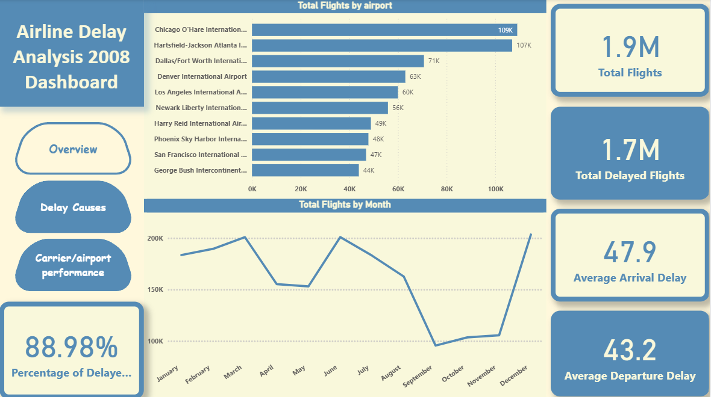
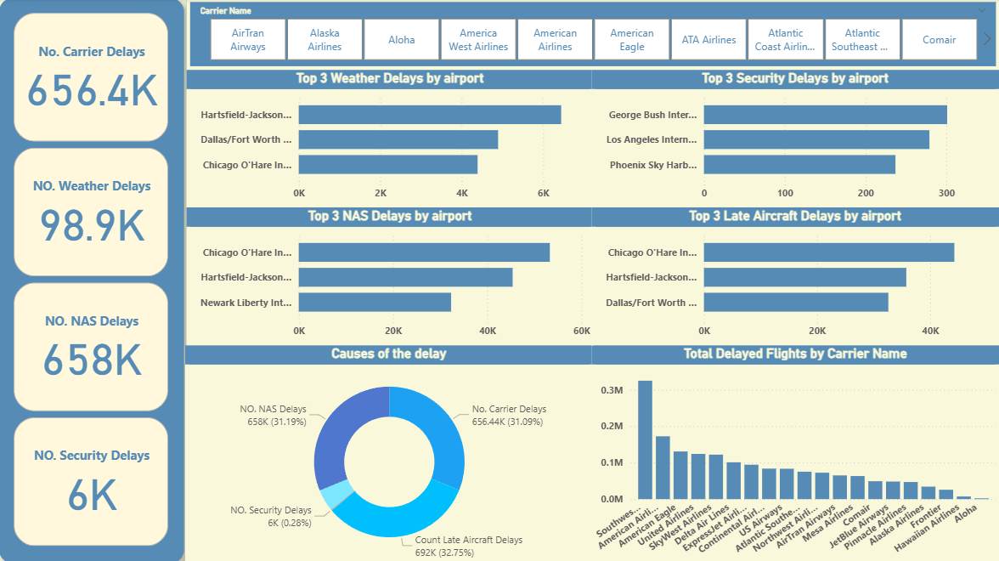
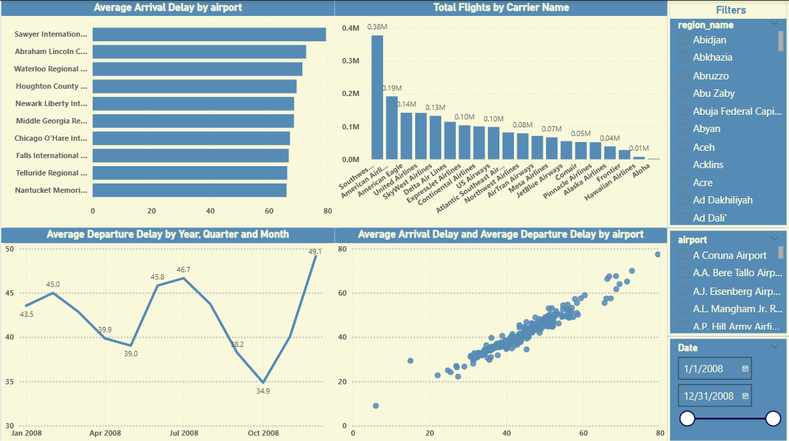

# Airline Delay Causes Analysis Dashboard

A multi-page interactive Power BI dashboard analyzing airline delay trends, causes, and carrier performance using a publicly available Kaggle dataset.

---

## 📊 Tools Used:
- Power BI
- DAX
- Kaggle Airline Delay Causes Dataset

---

## 📄 Data Source:
- [Airline Delay Causes Dataset](https://www.kaggle.com/datasets/giovamata/airlinedelaycauses)
- `carrier.xlsx` (additional carrier reference data)
- `airport-codes_csv.csv`

---

## ⚙️ Data Preparation:
- Connected to the Kaggle CSV dataset and Excel file (`carrier.xlsx`)
- Created `Dates Table` using DAX for time-based analysis
- Cleaned and prepared data for analysis

---

## 📈 Measures Created:
- `Total Delays`
- `Percentage of Delays`
- `Average Delay Time`
- `Delays by Cause`
- `Total Delay Duration`
- `Delay Count by Carrier`
- `Delay Count by Airport`
- Time-based measures for Year, Month, Day breakdowns

---

## 📊 Dashboard Structure:
The report consists of **three main dashboard pages**:

- **Page 1: Overview**
  - KPIs: Total delays, average delay time, delay percentage
  - Trend line of delays over time
  - General performance summaries

- **Page 2: Delay Causes**
  - Breakdown of delays by cause
  - Delay duration by cause
  - Visual comparison of different delay reasons

- **Page 3: Carrier & Airport Performance**
  - Top/bottom carriers by delays
  - Delays by airport

Each page includes **navigation buttons** for smooth movement between dashboard pages.

---

## 📸 Dashboard Preview:

---

## 🎨 Creative Design Features:
- Multi-page navigation
- Modern clean layout
- Consistent color palette
- Balanced layout focusing on clear storytelling and highlighting delay patterns

---

## 📎 Project Files:
- `Airline Delay Causes Analysis Dashboard.pbix`
- `carrier.xlsx`
- `airports-codes_csv.csv`
- `dashboard-preview1.png`
- `dashboard-preview2.png`
- `dashboard-preview3.png`

---

## 📌 Notes:
This project demonstrates a multi-page interactive Power BI dashboard analyzing airline operations data, causes of delays, and carrier performance using real-world public data.

